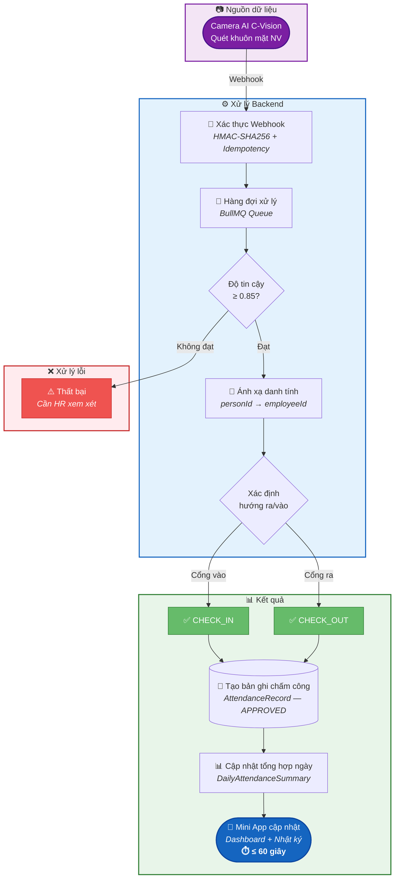
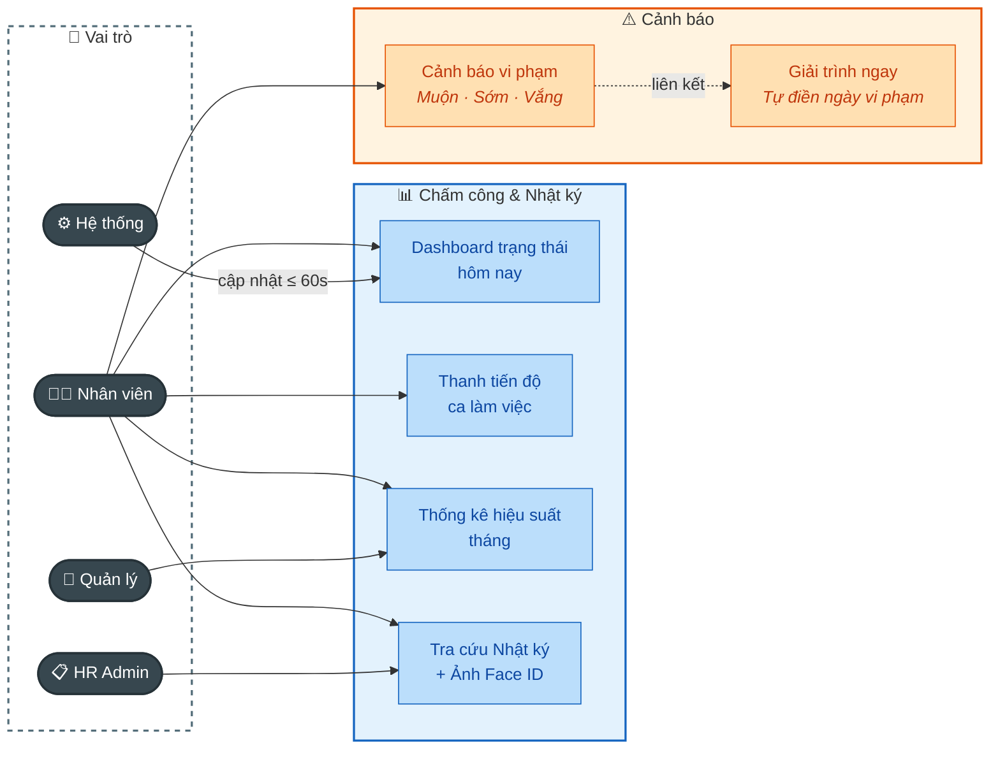

# 2.11.1. Chấm công và Nhật ký chấm công

---

| Thông tin | Nội dung |
| --- | --- |
| Target release | [Giai đoạn 1 - MVP] |
| Epic | Quản lý Chấm công (Attendance Management) |
| Document owner | ndthuy1 |
| Stakeholder | Nhân viên, HR Admin, Ban Giám đốc |
| Status | Open |

### **1. MỤC TIÊU**

- **Lý do tồn tại:** Cung cấp kênh phản hồi dữ liệu tức thời từ hệ thống AI Vision về cho người lao động.
- **Bài toán:** Trực quan hóa trong việc ghi nhận giờ công và giải quyết nhu cầu tự đối soát dữ liệu của nhân sự.
- **Giá trị mang lại:** Tăng tính minh bạch trong quản trị, giảm các thắc mắc/khiếu nại về mốc giờ chấm công vào cuối tháng.

---

### **2. MÔ TẢ QUY TRÌNH NGHIỆP VỤ**

---

### **3. NHU CẦU NGƯỜI DÙNG**

| Persona | Nhu cầu cụ thể | Tài liệu / Căn cứ |
| --- | --- | --- |
| Nhân viên (Staff) | Muốn biết mình đã chấm công thành công chưa ngay sau khi bước qua cửa sảnh. | Dashboard Trạng thái hôm nay |
| Nhân viên (Staff) | Muốn biết mình còn phải làm bao nhiêu tiếng nữa mới đủ ca (8h) để sắp xếp việc cá nhân. | Thanh Tiến độ làm việc |
| Nhân viên (Staff) | Muốn xem lại ảnh chụp của mình khi quẹt thẻ để chắc chắn hệ thống không nhận diện nhầm người. | Nhật ký Chấm công |

---

### **4. USE CASE**

---

### **5. PHẠM VI CHỨC NĂNG**

| Mã | Chức năng | Mô tả | User Story |
| --- | --- | --- | --- |
| ATTEN_1 | Dashboard Hôm nay | Hiển thị mốc giờ Vào/Ra, Ngày tháng và Badge trạng thái (Đã chấm công/Chưa chấm công). | Là NV, tôi muốn thấy giờ vào sảnh ngay lập tức để an tâm bắt đầu ca làm việc. |
| ATTEN_2 | Thanh Tiến độ | Hiển thị dạng Progress Bar: Giờ làm thực tế/8h. Tự động cập nhật theo thời gian thực. | Là NV, tôi muốn biết mình đã hoàn thành bao nhiêu % ca làm để cân đối thời gian ra về. |
| ATTEN_3 | Thẻ Thống kê tháng | Hiển thị 03 chỉ số: % Đúng giờ, Tổng ngày nghỉ và Giờ tăng ca lũy kế đến hiện tại. | Là NV, tôi muốn theo dõi hiệu suất tháng của mình để đảm bảo KPI chuyên cần. |
| ATTEN_4 | Nhật ký chi tiết | Danh sách nhật ký dạng Accordion. Mở rộng để xem Ảnh Face ID, Địa điểm và mốc giây quẹt. | Là NV, tôi muốn xem lại ảnh đối soát để minh bạch hóa giờ công khi có tranh chấp. |

---

### **6. YÊU CẦU PHI CHỨC NĂNG**

- **Độ trễ đồng bộ**: Dữ liệu từ Camera hiển thị trên App không chậm quá **60 giây**.
- **Hiệu năng**: Tốc độ tải màn Dashboard và Nhật ký trong **≤ 3 giây**.
- **Bảo mật**: Cơ chế **RBAC** đảm bảo nhân viên chỉ nhìn thấy dữ liệu cá nhân của chính mình.

---

### **7. ĐIỀU KIỆN GIẢ ĐỊNH**

1. Người dùng đã đăng nhập thành công vào hệ thống Mini App.
2. Nhân viên đã được HR gán Lịch làm việc/Ca kíp hợp lệ.
3. C-Vision Camera đã được kích hoạt và đồng bộ Internet ổn định.
