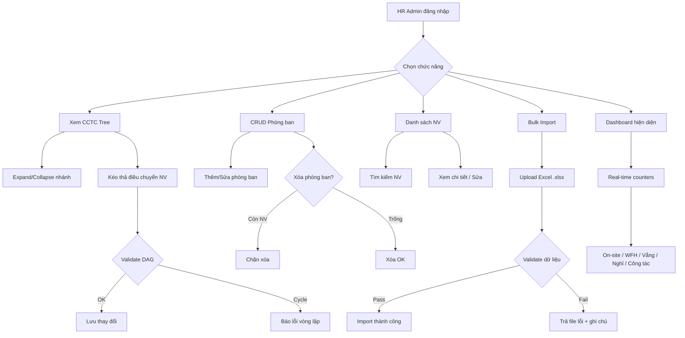
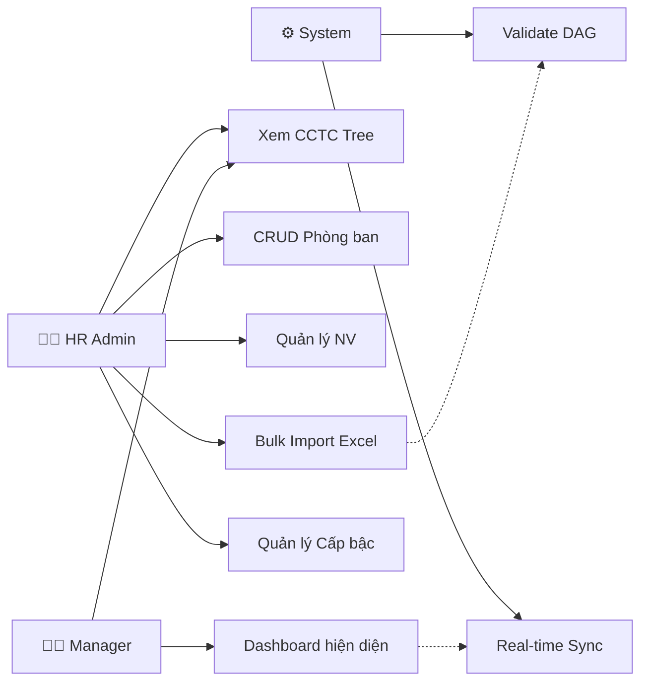

 # 2.11.6. Quản lý Nhân sự & Cơ cấu tổ chức

---

| Thông tin | Nội dung |
| --- | --- |
| Target release | Version 1.0 (Sprint 8) |
| Epic | Module 05 – Nhân sự & CCTC |
| Document owner | BA Team |
| Stakeholder | HR Admin, Quản lý |
| Status | Draft |
| Tham chiếu | EAMS v2.0 §2 (Mô hình tổ chức) |

---

### **1. MỤC TIÊU**

- **Lý do tồn tại:** Cần quản lý danh sách nhân sự tập trung (họ tên, mã NV, email, phòng ban, trạng thái) phục vụ cho tất cả modules khác.
- **Bài toán:** Import nhân viên hàng loạt, quản lý phòng ban dạng cây, theo dõi hiện diện real-time.
- **Giá trị mang lại:** Là "master data" nền tảng cho toàn hệ thống chấm công.

---

### **2. PHẠM VI CHỨC NĂNG**

| Mã | Chức năng | Mô tả chi tiết | User Story |
| --- | --- | --- | --- |
| F05.1 | Sơ đồ cơ cấu tổ chức | Hiển thị dạng cây: Tổ chức → Chi nhánh (Site) → Phòng ban → Nhóm → Nhân viên. Hỗ trợ Expand/Collapse, kéo thả điều chuyển. | Là HR, tôi muốn xem toàn cảnh CCTC dạng trực quan. |
| F05.2 | CRUD Phòng ban | Thêm/Sửa/Xóa Khối/Phòng ban/Đội nhóm. Chặn xóa nếu còn nhân sự. | Là HR, tôi muốn tạo phòng ban mới khi có thay đổi tổ chức. |
| F05.3 | Danh sách nhân sự | View danh sách NV: ID, Họ tên, Email, Phòng ban, Trạng thái (Active/Inactive/Transferred), Ảnh chân dung. | Là HR, tôi muốn tra cứu nhanh thông tin nhân viên. |
| F05.4 | Bulk Import NV | Import danh sách NV từ file Excel mẫu (.xlsx). Validate: Mã NV unique, Email unique, Phòng ban tồn tại. Trả file lỗi kèm cột ghi chú. | Là HR, tôi muốn nhập 500 NV mới khi onboard chi nhánh. |
| F05.5 | Dashboard hiện diện | Hiển thị số lượng: On-site / WFH / Vắng mặt / Nghỉ phép. Cập nhật real-time. | Là Manager, tôi muốn biết ai đang có mặt tại VP. |
| F05.6 | Danh mục Cấp bậc | Quản lý danh mục: Nhân viên, Trưởng nhóm, Trưởng phòng → phục vụ phân quyền. | Là HR, tôi muốn thiết lập cấp bậc cho hệ thống phân quyền. |

---

### **3. MÔ HÌNH TỔ CHỨC** *(Nguồn: EAMS v2.0 §2)*

```
Organization (Tenant)
├─ Site A (Chi nhánh)
│  ├─ Phòng ban
│  │  ├─ DEPT_HEAD (Trưởng phòng)
│  │  ├─ MANAGER (Quản lý nhóm)
│  │  │  ├─ EMPLOYEE
│  │  │  └─ EMPLOYEE
│  ├─ SITE_HR_ADMIN (HR chi nhánh)
│  └─ SITE_MANAGER (Quản lý chi nhánh)
└─ GLOBAL_HR_ADMIN (HR Tổng, scope: ALL_SITES)
```

- Nhân viên có thể thuộc nhiều chi nhánh (VD: IT hỗ trợ multi-site)
- Mỗi NV có Primary Site + Status per site (ACTIVE/INACTIVE/TRANSFERRED)

---

### **4. YÊU CẦU PHI CHỨC NĂNG**

- Tìm kiếm nhanh: không phân biệt hoa/thường/dấu
- Import: Hỗ trợ ≤ 5,000 bản ghi/lần, thời gian xử lý ≤ 30 giây
- RBAC: HR chi nhánh chỉ quản lý NV thuộc site mình

---

### **5. PROCESS FLOW**



### **6. USE CASE DIAGRAM**



---

### **EDGE CASES & ERROR HANDLING (toàn module)**

| # | US | Case | Severity | Expected Behavior |
|---|-----|------|----------|-------------------|
| E01-E1 | EMP-01 | **Circular reference trong cây tổ chức** — Dept A là cha của Dept B, Dept B là cha của Dept A (kéo thả sai) | HIGH | Validate DAG (Directed Acyclic Graph) trước khi lưu. Nếu phát hiện cycle → chặn + thông báo "Không thể tạo vòng lặp trong cơ cấu tổ chức". |
| E04-E1 | EMP-04 | **Import idempotency** — HR upload cùng file 2 lần | MEDIUM | Lần 2: NV đã tồn tại (cùng Mã NV) → Skip toàn bộ. Hiển thị kết quả: "X bản ghi đã tồn tại — bỏ qua". Không tạo duplicate. |
| E04-E2 | EMP-04 | **Cần rollback import** — Import 5000 NV, 4000 thành công, phát hiện file sai | HIGH | Cung cấp chức năng "Hủy import" trong vòng 30 phút. Sau 30 phút → lock. Hủy import → xóa toàn bộ NV được tạo trong batch đó (theo batchId). Ghi audit log. |
| E05-E1 | EMP-05 | **NV Công tác (Business Travel)** — Dashboard hiện diện thiếu trạng thái Công tác | MEDIUM | Thêm trạng thái thứ 5: On-site / WFH / Công tác / Vắng mặt / Nghỉ phép. NV có đơn Công tác APPROVED → counter "Công tác". |
| E05-E2 | EMP-05 | **NV ca linh hoạt (FLEXIBLE/FREE)** — Không có giờ bắt đầu ca cố định | MEDIUM | NV ca FREE: "Vắng mặt" chỉ tính khi hết ngày làm việc (23:59) mà không có mốc check-in nào. Trong ngày: hiển thị "Chưa check-in" (Xám) thay vì "Vắng mặt" (Đỏ). |

---

### **5. ĐIỀU KIỆN GIẢ ĐỊNH**

1. Người dùng đã đăng nhập với role HR Admin hoặc cao hơn.
2. Hệ thống đã khởi tạo tenant và ít nhất 1 site.
