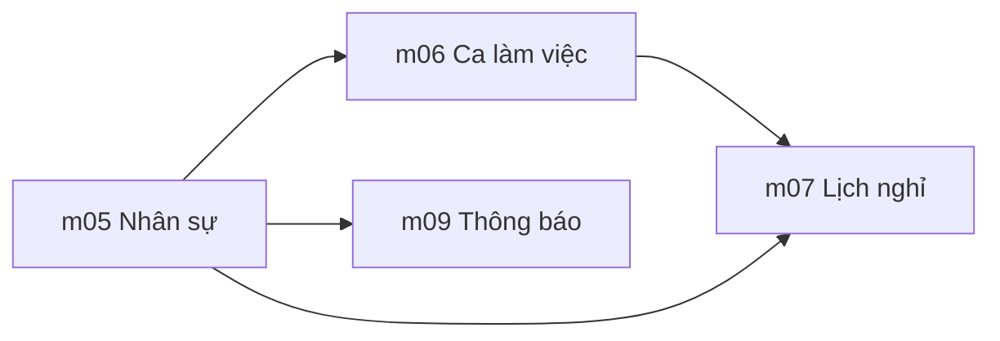

# Phase 01: Thiết lập hệ thống

**Sprint:** 8 | **ETA:** 5 ngày | **Phụ thuộc:** Không (phase đầu tiên)

## Thứ tự triển khai

1. **m05 Quản lý Nhân sự** — Master data nền tảng (NV, Phòng ban, CCTC). Mọi module khác đều cần dữ liệu NV.
2. **m06 Ca làm việc** — Cấu hình ca (In/Out/Break/Punch Limit). Phụ thuộc NV để gán ca.
3. **m07 Lịch nghỉ** — Ngày lễ, policy nghỉ. Phụ thuộc NV + Ca để tính công.
4. **m09 Thông báo** — Kênh, sự kiện, policy gửi. Phụ thuộc NV để gửi.

## Dependency Graph

## Dev Checklist

- [ ] m05: CRUD NV + Import Excel + Sơ đồ CCTC + Dashboard hiện diện + Danh mục cấp bậc (6 US)
- [ ] m06: CRUD Ca + Giờ/Ngày + Punch Limit + Break + Import NV vào ca + Pattern xoay (6 US)
- [ ] m07: CRUD Ngày nghỉ + Policy + Batch Job + API hiển thị (4 US)
- [ ] m09: Kênh + Sự kiện kích hoạt + Policy gửi (3 US)

## Liên kết

- [m05 Quản lý Nhân sự](./m05-quan-ly-nhan-su/README.md) — 6 US · api-spec · db-schema
- [m06 Ca làm việc](./m06-ca-lam-viec/README.md) — 6 US · api-spec · db-schema
- [m07 Lịch nghỉ](./m07-lich-nghi/README.md) — 4 US · api-spec · db-schema
- [m09 Thông báo](./m09-thong-bao/README.md) — 3 US · api-spec · db-schema
