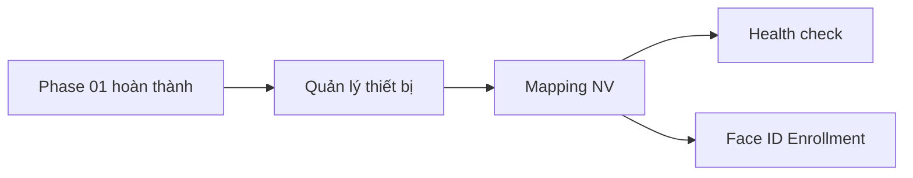

# Phase 02: Định danh Camera AI

**Sprint:** 8 | **ETA:** 6 ngày | **Phụ thuộc:** Phase 01 (cần NV master data)

## Thứ tự triển khai

1. **m08 Camera AI** — Đăng ký camera, mapping NV, health check, Face ID enrollment.
   - CRUD thiết bị → Mapping NV → Health monitoring → Face enrollment (dễ→khó)

## Dependency Graph

## Dev Checklist

- [ ] m08: CRUD Camera + Direction detection (US-CAM-01)
- [ ] m08: CVisionPersonMapping + Bulk-create (US-CAM-02)
- [ ] m08: Health check dashboard + Alert (US-CAM-03)
- [ ] m08: Face ID Enrollment wizard 3 bước (US-CAM-04)

## Liên kết

- [m08 Camera AI](./m08-camera-ai/README.md) — 4 US · api-spec · db-schema
