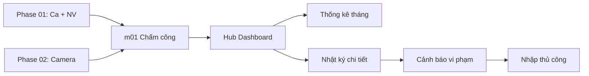

# Phase 03: Vận hành chấm công

**Sprint:** 8 | **ETA:** 2 ngày | **Phụ thuộc:** Phase 01 + 02 (cần Ca + Camera active)

## Thứ tự triển khai

1. **m01 Chấm công & Nhật ký** — Dashboard NV, tiến độ ca, nhật ký, cảnh báo, nhập thủ công.
   - Hub chấm công → Tiến độ → Nhật ký → Cảnh báo → Nhập thủ công (dễ→khó)

## Dependency Graph

## Dev Checklist

- [ ] m01: Hub chấm công — Badge, giờ In/Out, tiến độ (US-ATTEN-01)
- [ ] m01: Thống kê hiệu suất tháng — 3 thẻ (US-ATTEN-02)
- [ ] m01: Nhật ký accordion — Ảnh Face ID, mốc giây (US-ATTEN-03)
- [ ] m01: Cảnh báo vi phạm — Muộn/Sớm/Vắng, nút Giải trình (US-ATTEN-04)
- [ ] m01: Nhập chấm công thủ công — HR nhập khi camera lỗi (US-ATTEN-05)

## Liên kết

- [m01 Chấm công](./m01-cham-cong/README.md) — 5 US · api-spec · db-schema
