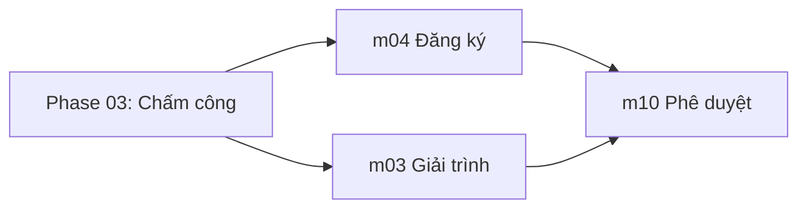

# Phase 04: Xử lý đơn từ

**Sprint:** 9 | **ETA:** 8 ngày | **Phụ thuộc:** Phase 03 (cần dữ liệu chấm công)

## Thứ tự triển khai

1. **m04 Trung tâm Đăng ký** — Nghỉ phép, Đổi ca, OT, Theo dõi đơn, Cấu hình phép.
2. **m03 Giải trình công** — Danh sách lỗi, Yêu cầu sửa chấm công. Phụ thuộc dữ liệu chấm công.
3. **m10 Phê duyệt** — Inbox, Approval chain, Batch approve. Phụ thuộc m04 + m03.

## Dependency Graph

## Dev Checklist

- [ ] m04: Đăng ký nghỉ phép — 8 loại, balance check (US-REG-01)
- [ ] m04: Đăng ký đổi ca — Xung đột check (US-REG-02)
- [ ] m04: Đăng ký OT — Giới hạn ngày/tuần/tháng/năm (US-REG-03)
- [ ] m04: Theo dõi đơn + hạn mức — Danh sách, hủy, balance widget (US-REG-04)
- [ ] m04: Cấu hình chính sách phép — Policy admin, batch recalculate (US-REG-05)
- [ ] m03: Danh sách lỗi cần giải trình — Anomaly, ngày chốt, exception (US-EXPL-01)
- [ ] m03: Yêu cầu sửa chấm công — ADD/MODIFY/DELETE correction (US-EXPL-02)
- [ ] m10: Inbox phê duyệt — Filter, chi tiết, duyệt/từ chối (US-APPR-01)
- [ ] m10: Cấu hình chuỗi phê duyệt — Chain, fallback, ngày chốt (US-APPR-02)
- [ ] m10: Phê duyệt hàng loạt — Batch max 50, partial success (US-APPR-03)

## Liên kết

- [m04 Trung tâm Đăng ký](./m04-trung-tam-dang-ky/README.md) — 5 US
- [m03 Giải trình](./m03-giai-trinh/README.md) — 2 US
- [m10 Phê duyệt](./m10-phe-duyet/README.md) — 3 US
