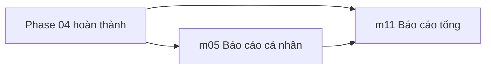

# Phase 05: Báo cáo & Hoàn thiện

**Sprint:** 10 | **ETA:** 3 ngày | **Phụ thuộc:** Tất cả phases trước (cần dữ liệu tổng hợp)

## Thứ tự triển khai

1. **m05 Báo cáo cá nhân** — Score, KPI, trend cho NV.
2. **m11 Báo cáo tổng** — Dashboard quản lý, xuất payroll, tuân thủ, payroll lock.

## Dependency Graph

## Dev Checklist

- [ ] m05-rpt: Dashboard hiệu suất cá nhân — Score, trend 4 tuần (US-RPTPRS-01)
- [ ] m05-rpt: Bảng KPI quý — So sánh, highlights (US-RPTPRS-02)
- [ ] m11: Dashboard quản lý — 6 counters, biểu đồ, top vi phạm (US-RPT-01)
- [ ] m11: Xuất báo cáo + Payroll — 5 loại báo cáo, 13 cột payroll (US-RPT-02)
- [ ] m11: Báo cáo tuân thủ — Vi phạm, OT limit, giải trình quá hạn (US-RPT-03)
- [ ] m11: Khóa kỳ lương — Payroll lock, re-export versioning (US-RPT-04)

## Liên kết

- [m05 Báo cáo cá nhân](./m05-bao-cao-ca-nhan/README.md) — 2 US
- [m11 Báo cáo tổng](./m11-bao-cao-tong/README.md) — 4 US
